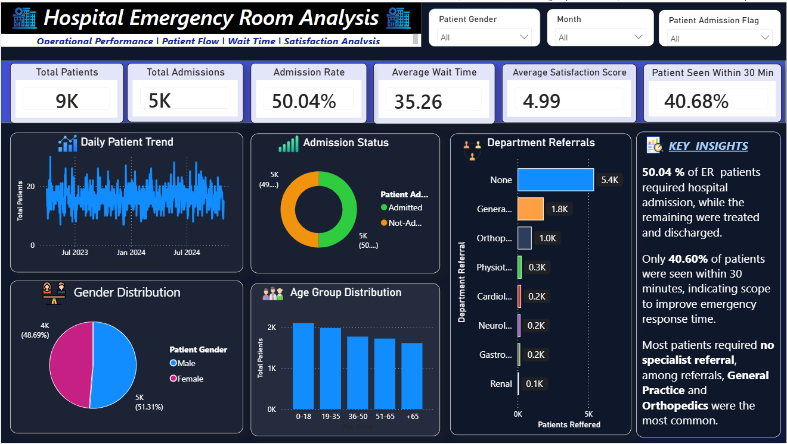

# 🏥 Hospital Emergency Room Analysis Dashboard

An end-to-end **Business Intelligence** project developed using **Power BI**, **Power Query**, and **DAX** to analyze Emergency Room (ER) operations. The dashboard transforms raw hospital data into actionable insights, enabling healthcare stakeholders to monitor patient flow, admissions, waiting times, satisfaction, and departmental referrals for informed decision-making.

---

## 📌 Project Overview

Emergency Rooms generate large volumes of operational data every day. Without proper analysis, it becomes difficult for hospital administrators to identify service bottlenecks, optimize resources, and improve patient care.

This project demonstrates the complete data analytics lifecycle—from understanding business requirements and preparing data to designing an interactive dashboard that supports data-driven healthcare decisions.

---

## 🎯 Business Objectives

- Analyze Emergency Room patient volume.
- Monitor hospital admission rates.
- Measure average patient waiting time.
- Track patient satisfaction.
- Identify department referral patterns.
- Understand patient demographics.
- Support operational decision-making using interactive dashboards.

---

## 📊 Dashboard Preview

> **📷 Dashboard Screenshot**

*Add your dashboard screenshot here after uploading it to the Images folder.*

```text

```

---

## 🚀 Dashboard Features

- Executive KPI Cards
- Interactive Slicers
- Daily Patient Trend Analysis
- Admission Status Analysis
- Department Referral Analysis
- Patient Age Group Distribution
- Gender Distribution
- Executive Business Insights
- Cross-filtering across visuals

---

## 📈 Key Performance Indicators (KPIs)

| KPI | Description |
|------|-------------|
| Total Patients | Total number of Emergency Room visits |
| Total Admissions | Total admitted patients |
| Admission Rate | Percentage of admitted patients |
| Average Wait Time | Average patient waiting time |
| Average Satisfaction Score | Average patient satisfaction rating |
| Patients Seen Within 30 Minutes | Percentage of patients attended within the target response time |

---

## 🛠️ Tools & Technologies

- **Power BI Desktop**
- **Power Query**
- **DAX (Data Analysis Expressions)**
- **Data Modeling**
- **Microsoft Excel / CSV**
- **Git & GitHub**

---

## 🔄 Project Workflow

```text
Business Understanding
        ↓
Data Quality Assessment
        ↓
Data Cleaning (Power Query)
        ↓
Data Modeling
        ↓
Calendar Table Creation
        ↓
DAX Measure Development
        ↓
Dashboard Development
        ↓
Business Insights
        ↓
Recommendations
```

---

## 📂 Repository Structure

```text
Hospital-Emergency-Room-Analysis
│
├── Dashboard/
│   └── Hospital Emergency Room Analysis.pbix
│
├── Dataset/
│   └── Hospital Emergency Room Data.csv
│
├── Documentation/
│   ├── 01_Business_Requirements.md
│   ├── 02_Business_Questions.md
│   ├── 03_Data_Dictionary.md
│   ├── 04_Data_Quality_Assessment.md
│   ├── 05_Data_Cleaning_Log.md
│   ├── 06_Data_Model.md
│   ├── 07_DAX_Measures.md
│   ├── 08_Insights.md
│   └── 09_Recommendations.md
│
├── Images/
│   ├── Dashboard.png
│   ├── Data_Model.png
│   └── Power_Query.png
│
├── LICENSE
└── README.md
```

---

## 📚 Documentation

Detailed project documentation is available in the **Documentation** folder and includes:

- Business Requirements
- Business Questions
- Data Dictionary
- Data Quality Assessment
- Data Cleaning Log
- Data Model
- DAX Measures
- Business Insights
- Business Recommendations

---

## 💡 Key Insights

- Approximately **50%** of Emergency Room patients required hospital admission.
- Only **40.68%** of patients were attended within **30 minutes**, highlighting opportunities to improve response time.
- Most patients required **no specialist referral**, while **General Practice** and **Orthopedics** received the highest referral volumes.
- Patient visits remained relatively stable throughout the analysis period.
- Gender distribution was nearly balanced across all patient visits.

---

## 📌 Business Recommendations

- Improve triage processes to reduce patient waiting times.
- Optimize staffing during high-demand periods.
- Monitor referral-heavy departments for resource planning.
- Continue tracking patient satisfaction to improve healthcare quality.
- Use dashboard insights for ongoing operational performance monitoring.

---

## ⭐ Skills Demonstrated

- Business Understanding
- Data Cleaning
- Data Transformation
- Data Modeling
- DAX Development
- Time Intelligence
- KPI Design
- Dashboard Development
- Data Visualization
- Business Storytelling
- Healthcare Analytics

---

## 📄 License

This project is licensed under the **MIT License**.

---

## 👨‍💻 Author

**Priya Vishwakarma**

Data Analyst | Power BI | SQL | Python | Excel

If you found this project useful, feel free to ⭐ this repository.
